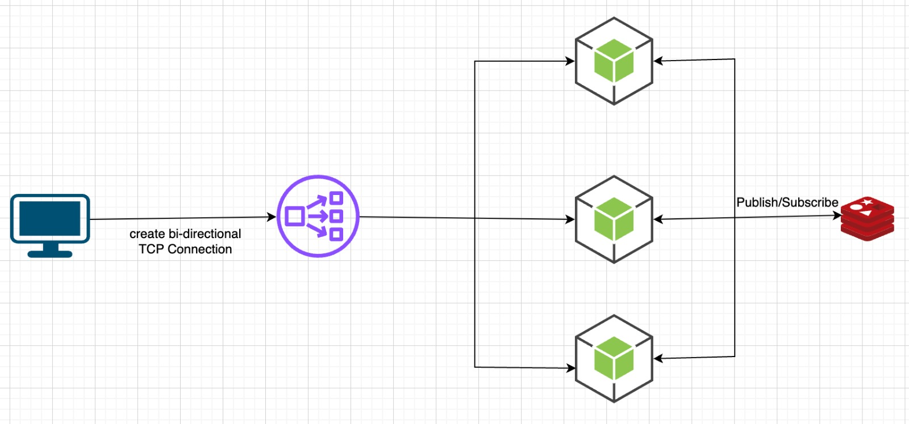
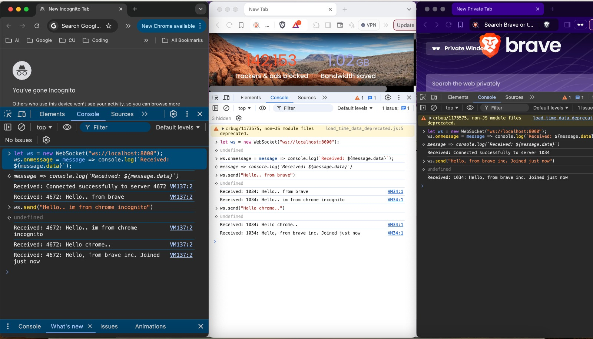

### step 1: Run docker-compose up
### step 2: open a browser console and type this

let ws = new WebSocket("ws://localhost:8000");

ws.onmessage = message => console.log(`Received: ${message.data}`);

ws.send("Hello!")

### step 3: open multiple console windows to simulate multiple clients

## Flow

## Demo

